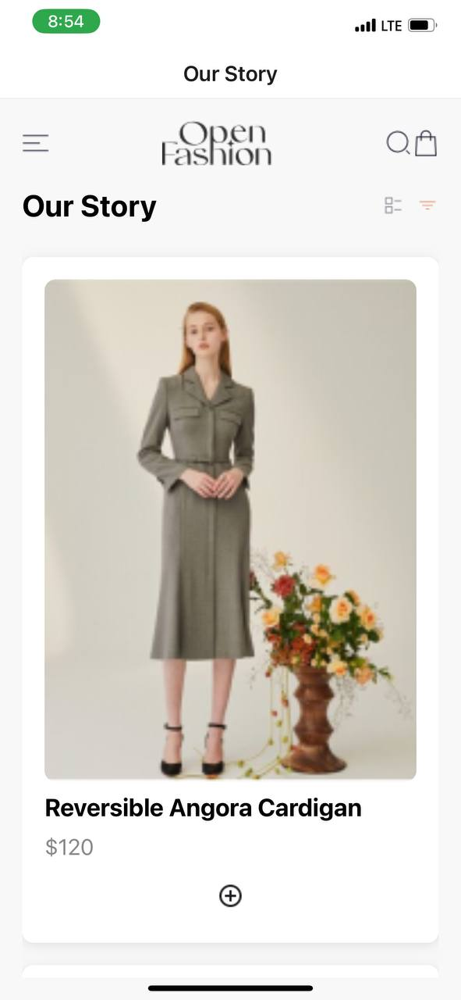
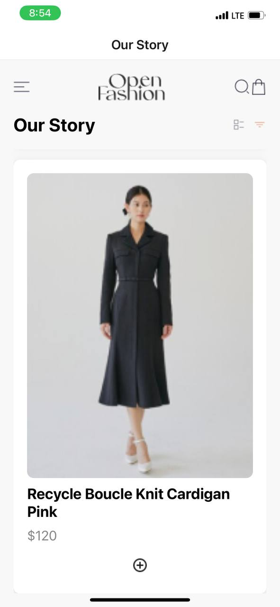
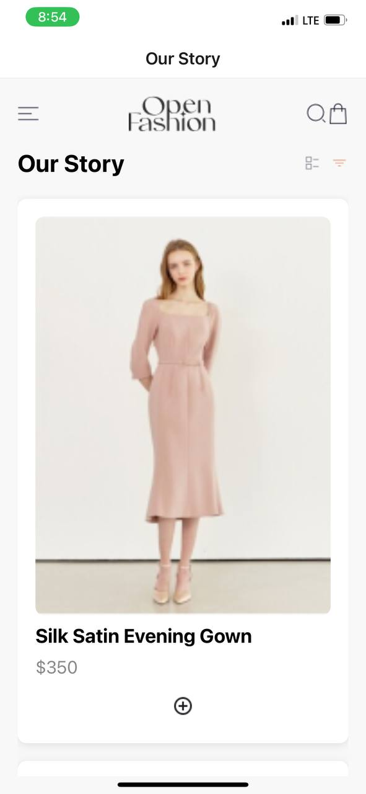
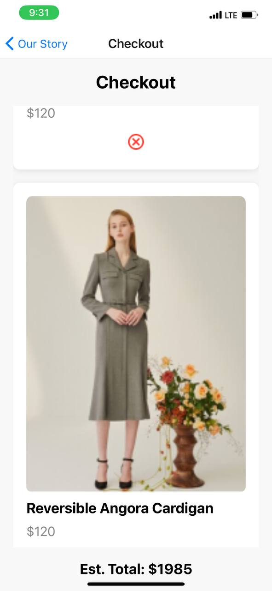
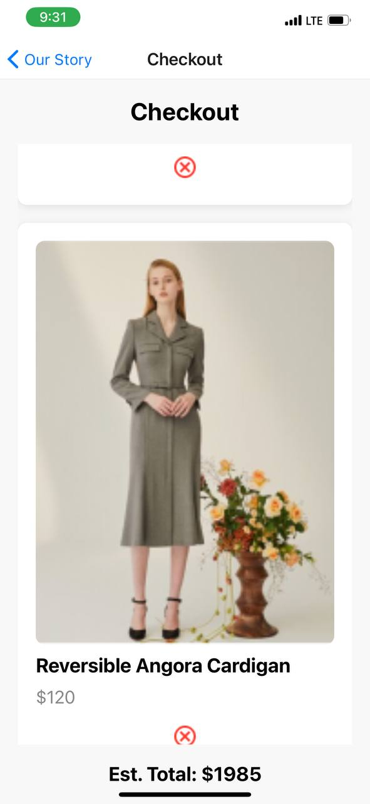
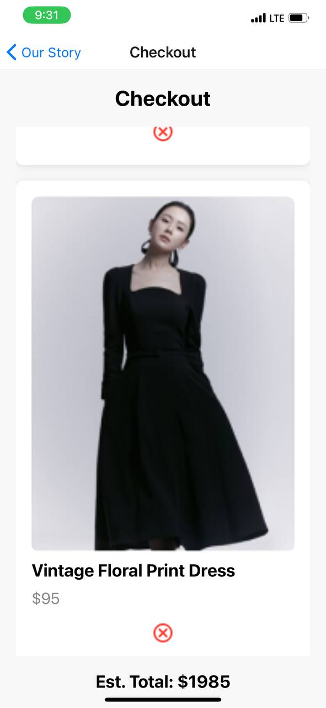

## DCIT 202 ASSIGNMENT 6

## ID NUMBER: 11290273

## Features
 - **Home Screen**: It displays a list of in-stock clothes or products.
 - **Cart Screen**: It shows all the items that have been added to the cart.
 - **Add to Cart**: A button to add products to the cart.
 - **Remove from Cart**: A button to remove items from the cart.

 ## Technologies Used
 - **React Native**
 - **AsyncStorage**
 - **React Navigation**

 ## My Design Choices
- **Local Storage**: Because of AsyncStorage's ease of use and seamless integration with React Native, it was selected. Cart items can be efficiently stored and retrieved thanks to it.

- **Navigation**: The transition between the HomeScreen and CartScreen was executed by React Navigation.

- **UI Components**: The provided mockup served as the basis for selecting the UI components. To make an interface that is easy to use, I used components from React Native.

## Data Storage Implementation
  AsyncStorage is where selected objects are kept. This guarantees that even when the app is closed or the device is restarted, the contents of the cart remain intact.

  ## Screenshots
  

  

  

  

  

  

  

  

  

  
  
  
